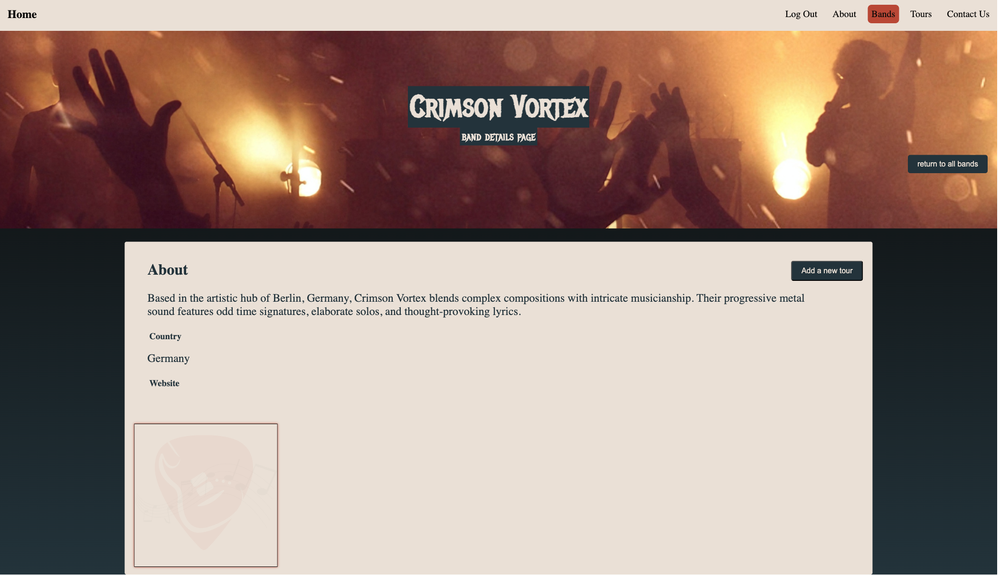

# Crowdfunding Front End

bandtogthr is a platform to raise funds to get international metal bands to include Perth on their tour downunder.

The deployed bandtogethr website <https://bandtogethr.netlify.app/>

Project background and back end on GitHub <https://github.com/cathodert/crowdfunding_back_end>
Deployed backend on heroku <https://bandtogethr-e2b0af362861.herokuapp.com>

## Things to note

- A user must be logged in to create a band or a tour.
- Any user can create a band (as at 15 December 2024). Future plan to enable permissions so only people who identify as band member can create a band.
- Only the owner of the band can create a tour. The 'Add a new tour' button will only be visible for the band owner (i.e. user who created the band).

## Things to do

- Make updates to CSS. Lots of issues.
- Add zod (or alternative) to forms (NB was unable to import zod based on terminal prompt provided)
- Implement appropriate error messages.
- Did not complete PUT functionality at this point. Was having an authorisation error with token not being recogised. I have therefore commented out this functionality so it does not appear on deployed version.
- As above - limit ability to create bands to users who select band member only.

## Screenshots

As per assignment requirements:

### Home page

### All bands page

### Create band form

### Band page

Redirects to this page once band created

### Create tour form

Only visible to band 'owner'

### Create pledge

